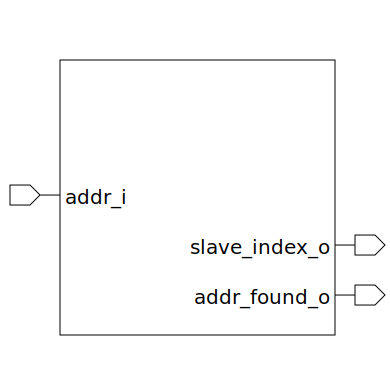

# addr_decoder (module)

### Author : Foez Ahmed (foez.official@gmail.com)

## TOP IO

## Description
 Address decored module

## Parameters
|Name|Type|Dimension|Default Value|Description|
|-|-|-|-|-|
|ADDR_WIDTH|int||default_param_pkg::ADDR_DECODER_ADDR_WIDTH|address width|
|NUM_SLV|int||default_param_pkg::ADDR_DECODER_NUM_SLV|num slave|
|NUM_RULES|int||default_param_pkg::ADDR_DECODER_NUM_RULES|num address map rules|
|addr_map_t|type||default_param_pkg::addr_decoder_addr_map_t|address map type|
|ADDR_MAP|addr_map_t|[NUM_RULES]|default_param_pkg::ADDR_MAP|address map|

## Ports
|Name|Direction|Type|Dimension|Description|
|-|-|-|-|-|
|addr_i|input|logic [ADDR_WIDTH-1:0]||address input|
|slave_index_o|output|logic [$clog2(NUM_SLV)-1:0]||slave index output|
|addr_found_o|output|logic||slave index valid|
