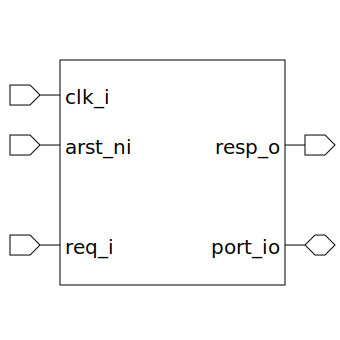

# axi4l_gpio (module)

### Author : Foez Ahmed (foez.official@gmail.com)

## TOP IO


## Description

The General-Purpose Input/Output (GPIO), allows us to program individual pins as either an input or
an output. Each pin works off of 4 different register which are:
- 1. rdata: read-only register for reading actual value on the pin.
- 2. wdata: read-write register for output or pull of the pin.
- 3. wen: strongly drive the pin with wdata
- 4. pull: weakly drive the pin with wdata

The `port_io` is a byte array (i.e. each port is byte addressable).

The number of bytes in the port is defined by parameter `PORT_SIZE`
(i.e. the port will have `2^PORT_SIZE`).

The Base address of each type of register is define as following:

```
BlockSize = ((AXI_DATA_WIDTH/8) > (2**PORT_SIZE)) ?
                (AXI_DATA_WIDTH/8) :
                (2**PORT_SIZE) ;

RdataBase = BlockSize * 0;
WdataBase = BlockSize * 1;
WenBase   = BlockSize * 2;
PullBase  = BlockSize * 3;
```


## Parameters
|Name|Type|Dimension|Default Value|Description|
|-|-|-|-|-|
|axi4l_req_t|type||default_param_pkg::axi4l_req_t||
|axi4l_resp_t|type||default_param_pkg::axi4l_resp_t||
|PORT_SIZE|int||5||

## Ports
|Name|Direction|Type|Dimension|Description|
|-|-|-|-|-|
|clk_i|input|logic|||
|arst_ni|input|logic|||
|req_i|input|axi4l_req_t|||
|resp_o|output|axi4l_resp_t|||
|port_io|inout|wire [PortBytes-1:0][7:0]|||
