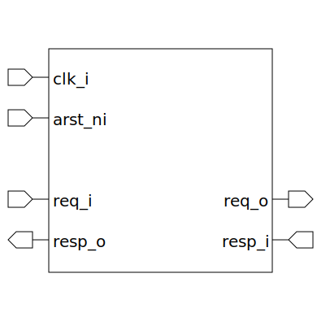

# axi_fifo (module)

### Author : Foez Ahmed (foez.official@gmail.com)

## TOP IO

## Description
 Description

## Parameters
|Name|Type|Dimension|Default Value|Description|
|-|-|-|-|-|
|axi_req_t|type||default_param_pkg::axi4l_req_t||
|axi_resp_t|type||default_param_pkg::axi4l_resp_t||
|AW_FIFO_DEPTH|int||4||
|W_FIFO_DEPTH|int||4||
|B_FIFO_DEPTH|int||4||
|AR_FIFO_DEPTH|int||4||
|R_FIFO_DEPTH|int||4||

## Ports
|Name|Direction|Type|Dimension|Description|
|-|-|-|-|-|
|clk_i|input|logic|||
|arst_ni|input|logic|||
|req_i|input|axi_req_t|||
|resp_o|output|axi_resp_t|||
|req_o|output|axi_req_t|||
|resp_i|input|axi_resp_t|||
