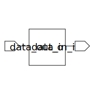

# bin_to_gray (module)

### Author : Foez Ahmed (foez.official@gmail.com)

## TOP IO

## Description

The `bin_to_gray` module is a binary to gray code converter. It takes a binary input (`data_in_i`)
and converts it to gray code (`data_out_o`).
The module uses a for loop to generate the gray code from the binary input. For each bit from the
least significant bit (LSB) to the second most significant bit (MSB-1), the gray code bit is the XOR
of the current binary bit and the next binary bit. The most significant bit (MSB) of the gray code
is the same as the MSB of the binary input.

## Parameters
|Name|Type|Dimension|Default Value|Description|
|-|-|-|-|-|
|DATA_WIDTH|int||4| // The width of the data. This is the number of bits in the binary and gray code|

## Ports
|Name|Direction|Type|Dimension|Description|
|-|-|-|-|-|
|data_in_i|input|logic [DATA_WIDTH-1:0]|| Binary code input. This is a `DATA_WIDTH`-bit binary number that is to be converted to gray code|
|data_out_o|output|logic [DATA_WIDTH-1:0]|| Gray code output. This is the `DATA_WIDTH`-bit gray code equivalent of the binary input|
