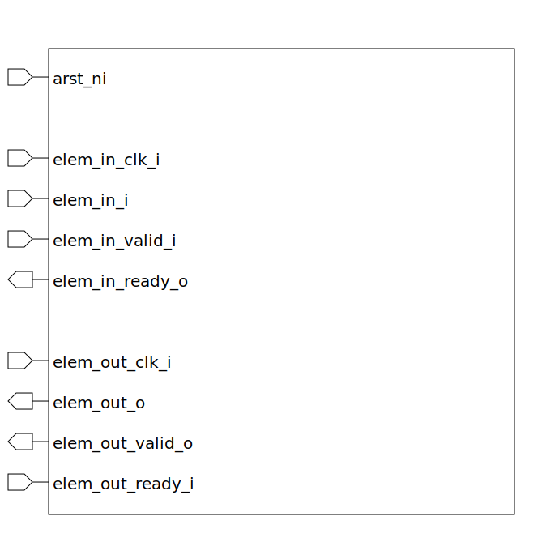

# cdc_fifo (module)

### Author : Foez Ahmed (foez.official@gmail.com)

## TOP IO

## Description

The `cdc_fifo` module is a clock domain crossing (CDC) FIFO. It takes an input element (`elem_in_i`)
under one clock domain (`elem_in_clk_i`) and outputs the element (`elem_out_o`) under another clock
domain (`elem_out_clk_i`).
The module uses a FIFO to transfer data across clock domains. The FIFO is written to under the input
clock domain and read from under the output clock domain. The write and read pointers are passed
across clock domains using gray code to prevent metastability issues. The FIFO is ready to accept
input when the write pointer does not equal the read pointer. The output is valid when the write
pointer equals the read pointer.

## Parameters
|Name|Type|Dimension|Default Value|Description|
|-|-|-|-|-|
|ELEM_WIDTH|int||8|The width of the elements in the FIFO|
|FIFO_SIZE|int||2|The size of the FIFO to the power of 2|

## Ports
|Name|Direction|Type|Dimension|Description|
|-|-|-|-|-|
|arst_ni|input|logic|| Asynchronous active low reset input|
|elem_in_i|input|logic [ELEM_WIDTH-1:0]|| Input element. This is a `ELEM_WIDTH`-bit data that is to be written into the FIFO|
|elem_in_clk_i|input|logic|| Input clock|
|elem_in_valid_i|input|logic|| Input valid signal. When high, indicates that the input element is valid and can be written into the FIFO|
|elem_in_ready_o|output|logic|| Input ready signal. When high, indicates that the FIFO is ready to accept the input element|
|elem_out_o|output|logic [ELEM_WIDTH-1:0]|| Output element. This is a `ELEM_WIDTH`-bit data that is read from the FIFO|
|elem_out_clk_i|input|logic|| Output clock|
|elem_out_valid_o|output|logic|| Output valid signal. When high, indicates that the output element is valid and can be read|
|elem_out_ready_i|input|logic|| Output ready signal. When high, indicates that the output element can be read from the FIFO|
