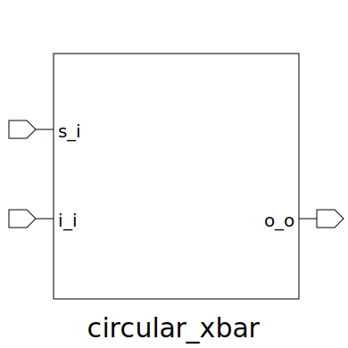

# circular_xbar (module)

### Author : Foez Ahmed (foez.official@gmail.com)

## TOP IO

## Description

The `circular_xbar` module is a parameterized SystemVerilog module that implements a circular
crossbar switch. The module uses a xbar to select the appropriate output based on the rotation base
select.

## Parameters
|Name|Type|Dimension|Default Value|Description|
|-|-|-|-|-|
|ELEM_WIDTH|int||8|width of each crossbar element|
|NUM_ELEM|int||6|number of elements in the crossbar|

## Ports
|Name|Direction|Type|Dimension|Description|
|-|-|-|-|-|
|s_i|input|logic [$clog2(NUM_ELEM)-1:0]|| rotation base select|
|i_i|input|logic [NUM_ELEM-1:0][ELEM_WIDTH-1:0]|| array of input buses|
|o_o|output|logic [NUM_ELEM-1:0][ELEM_WIDTH-1:0]|| array of output buses|
