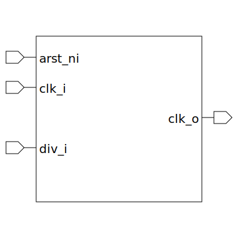

# clk_div (module)

### Author : Foez Ahmed (foez.official@gmail.com)

## TOP IO

## Description

The `clk_div` module is a frequency divider with a configurable divisor.

When the divisor is 1 or 0, the frequency division is bypassed, and the output clock is the same as
the input clock. Otherwise, the frequency division is performed by counting the clock cycles and
toggling the output clock when the count reaches the high or low count threshold.

The clock frequency divider uses sequential logic to implement the frequency division. The sequential
logic is sensitive to the rising edge of the input clock and the falling edge of the reset signal.
When the reset signal is not asserted, the counter is incremented at each clock cycle, and the
output clock is toggled when the count reaches the high or low count threshold.

## Parameters
|Name|Type|Dimension|Default Value|Description|
|-|-|-|-|-|
|DIVISOR_SIZE|int||9|size of the divisor register|

## Ports
|Name|Direction|Type|Dimension|Description|
|-|-|-|-|-|
|arst_ni|input|logic||asynchronous global reset signal|
|divisor_i|input|logic [DIVISOR_SIZE-1:0]|| clock divisor|
|clk_i|input|logic||input clock signal|
|clk_o|output|logic||output clock signal|
