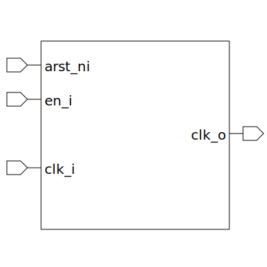

# clk_gate (module)

### Author : Foez Ahmed (foez.official@gmail.com)

## TOP IO

## Description

The `clk_gate` module is a clock gating module that enables or disables the input clock (`clk_i`)
based on the enable input (`en_i`). The gated clock is output on `clk_o`.
The module uses either a dual synchronizer or a latch to sample the enable signal (`en_i`). The
sampled enable signal is then used to gate the clock (`clk_i`). If `sampled_en_i` is high, the clock
is enabled and `clk_o` is equal to `clk_i`. If `sampled_en_i` is low, the clock is disabled and
`clk_o` is low.

## Parameters
|Name|Type|Dimension|Default Value|Description|
|-|-|-|-|-|
|USE_DUAL_SYNC|bit||1| A parameter that determines whether to use a dual synchronizer or a latch for sampling the enable signal. If `USE_DUAL_SYNC` is 1, a dual synchronizer is used|

## Ports
|Name|Direction|Type|Dimension|Description|
|-|-|-|-|-|
|arst_ni|input|logic|| Asynchronous active low reset input|
|en_i|input|logic|| Enable input. When high, the clock is enabled. When low, the clock is disabled|
|clk_i|input|logic|| Clock input|
|clk_o|output|logic|| Output clock. This is the gated clock based on `en_i`|
