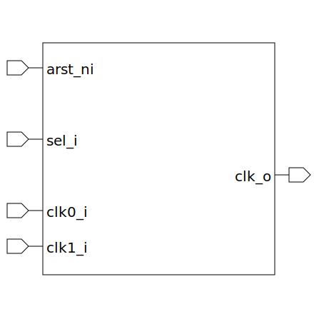

# clk_mux (module)

### Author : Foez Ahmed (foez.official@gmail.com)

## TOP IO

## Description

The `clk_mux` module is a glitch free clock multiplexer that selects between two input clocks
(`clk0_i` and `clk1_i`) based on the select input (`sel_i`). The selected clock is output on `clk_o`
The module uses dual flip-flop back-to-back synchronizers (`dual_flop_synchronizer`) for each input
clock. The synchronizers are used to mitigate metastability issues when switching between the
clocks. The select input (`sel_i`) determines which clock is selected. The selected clock is then
output on `clk_o`.

## Parameters
|Name|Type|Dimension|Default Value|Description|
|-|-|-|-|-|

## Ports
|Name|Direction|Type|Dimension|Description|
|-|-|-|-|-|
|arst_ni|input|logic||asynchronous active low reset input. Active low|
|sel_i|input|logic|| Select input. When high, `clk1_i` is selected. When low, `clk0_i` is selected|
|clk0_i|input|logic||Clock 0 input|
|clk1_i|input|logic||Clock 1 input|
|clk_o|output|logic||Output clock. This is the selected clock based on `sel_i`|
