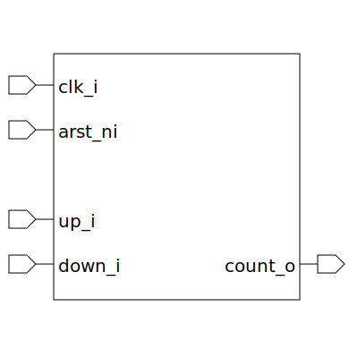

# counter (module)

### Author : Md. Mohiuddin Reyad (mreyad30207@gmail.com)

## TOP IO

## Description

The `counter` module is a configurable counter that can count up, down, or both based on the parameters set.

The counter's functionality is determined by the `UP_COUNT` and `DOWN_COUNT` parameters:

- If both `UP_COUNT` and `DOWN_COUNT` are enabled (`g_up_down`), the counter will increment if `up_i` is high and decrement if `down_i` is high. If the counter reaches `MAX_COUNT` while incrementing, it will wrap around to 0. Similarly, if it reaches 0 while decrementing, it will wrap around to `MAX_COUNT`.
- If only `UP_COUNT` is enabled (`g_up`), the counter will increment if `up_i` is high. It will wrap around to 0 if it reaches `MAX_COUNT`.
- If only `DOWN_COUNT` is enabled (`g_down`), the counter will decrement if `down_i` is high. It will wrap around to `MAX_COUNT` if it reaches 0.
- If neither `UP_COUNT` nor `DOWN_COUNT` is enabled (`g_nothing`), the counter will not change and `count_o` will always be 0.

The counter is reset to `RESET_VALUE` whenever `arst_ni` is low. The counter updates on the rising edge of `clk_i`.

## Parameters
|Name|Type|Dimension|Default Value|Description|
|-|-|-|-|-|
|MAX_COUNT|int||25|maximum count value|
|RESET_VALUE|bit [$clog2(MAX_COUNT+1)-1:0]||'0|value to reset the counter to|
|UP_COUNT|bit||1|If set to 1, the counter will increment|
|DOWN_COUNT|bit||1|If set to 1, the counter will decrement|

## Ports
|Name|Direction|Type|Dimension|Description|
|-|-|-|-|-|
|clk_i|input|logic||clock input|
|arst_ni|input|logic||asynchronous active low reset input|
|up_i|input|logic||increment control input|
|down_i|input|logic||decrement control input|
|count_o|output|logic [$clog2(MAX_COUNT+1)-1:0]||current count value|
