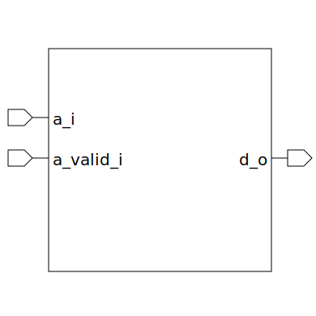

# decoder (module)

### Author : Foez Ahmed (foez.official@gmail.com)

## TOP IO

## Description

The `decoder` module is a parameterized SystemVerilog module that decodes an input address to an
output data line. The number of output lines is determined by the parameter `NUM_WIRE`.

The module operates by inverting the address input and storing it in `a_i_n`. It then performs a
bitwise AND operation on the inverted and non-inverted address inputs based on the current index.
The result is stored in `output_and_red`. If the address input is valid (`a_valid_i` is high), the
corresponding output line is enabled.

## Parameters
|Name|Type|Dimension|Default Value|Description|
|-|-|-|-|-|
|NUM_WIRE|int||4|This parameter determines the number of output wires|

## Ports
|Name|Direction|Type|Dimension|Description|
|-|-|-|-|-|
|a_i|input|logic [$clog2(NUM_WIRE)-1:0]||Address input|
|a_valid_i|input|logic||Address Valid input|
|d_o|output|logic [NUM_WIRE-1:0]||data output|
