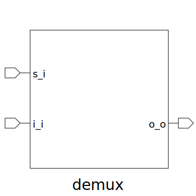

# demux (module)

### Author : Foez Ahmed (foez.official@gmail.com)

## TOP IO

## Description

The `demux` module is a demultiplexer with a configurable number of elements and element width.

It uses a for loop to generate the output array, where each element is the bitwise AND of the data
input and the corresponding valid output signal.

The demux uses a decoder to generate the valid output signals. The decoder takes the select input as
the address input, a constant '1' as the address valid input, and outputs the valid output signals.

## Parameters
|Name|Type|Dimension|Default Value|Description|
|-|-|-|-|-|
|NUM_ELEM|int||6|The number of elements|
|ELEM_WIDTH|int||8|The width of each element|

## Ports
|Name|Direction|Type|Dimension|Description|
|-|-|-|-|-|
|s_i|input|logic [$clog2(NUM_ELEM)-1:0]|| select input|
|i_i|input|logic [ELEM_WIDTH-1:0]|| data input|
|o_o|output|logic [NUM_ELEM-1:0][ELEM_WIDTH-1:0]|| output array|
