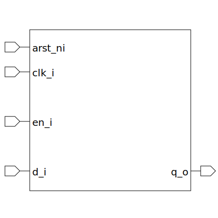

# dff (module)

### Author : Foez Ahmed (foez.official@gmail.com)

## TOP IO

## Description

The `dff` module is a D flip-flop with asynchronous active low reset
digital circuit design, commonly used for data storage and transfer.

The flip-flop samples the `d_i` input and updates the `q_o` output at the rising edge of the clock
`clk_i` if `en_i` is high. If `arst_ni` is low, the flip-flop resets the `q_o` output to
`RESET_VALUE` regardless of the clock or enable inputs.

## Parameters
|Name|Type|Dimension|Default Value|Description|
|-|-|-|-|-|
|RESET_VALUE|bit||'0| The value that the flip-flop resets to when `arst_ni` is low|

## Ports
|Name|Direction|Type|Dimension|Description|
|-|-|-|-|-|
|arst_ni|input|logic|| This is the asynchronous active low reset input. When this input is low, the flip-flop resets to `RESET_VALUE`|
|clk_i|input|logic|| This is the clock input. The flip-flop samples the `d_i` input at the rising edge of this clock|
|en_i|input|logic|| This is the enable input. When this input is high, the flip-flop samples the `d_i` input at the next clock rising edge|
|d_i|input|logic|| This is the data input. The value of this input is transferred to the output `q_o` at the rising edge of the clock `clk_i` if `en_i` is high|
|q_o|output|logic|| This is the data output. It holds the last value sampled from `d_i` at the rising edge of the clock `clk_i` when `en_i` was high, or the `RESET_VALUE` if `arst_ni` was low|
