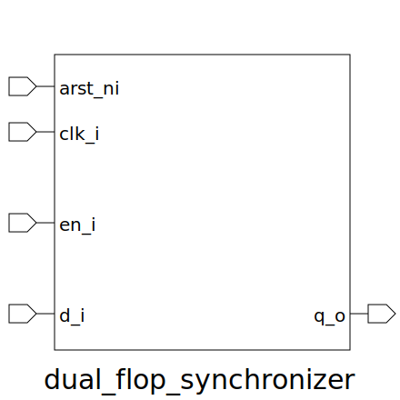

# dual_flop_synchronizer (module)

### Author : Foez Ahmed (foez.official@gmail.com)

## TOP IO

## Description

The `dual_flop_synchronizer` module is a parameterized SystemVerilog module that implements a dual
flip-flop synchronizer. The module uses two flip-flops to synchronize the input data signal to the
output.

## Parameters
|Name|Type|Dimension|Default Value|Description|
|-|-|-|-|-|
|FIRST_FF_EDGE_POSEDGED|bit||0| A bit that determines whether the first flip-flop runs on positive edges|
|LAST_FF_EDGE_POSEDGED|bit||0| A bit that determines whether the last flip-flop runs on positive edges|

## Ports
|Name|Direction|Type|Dimension|Description|
|-|-|-|-|-|
|arst_ni|input|logic||asynchronous active low reset signal|
|clk_i|input|logic||global clock signal|
|en_i|input|logic||enable signal|
|d_i|input|logic||data input signal|
|q_o|output|logic||output signal|
