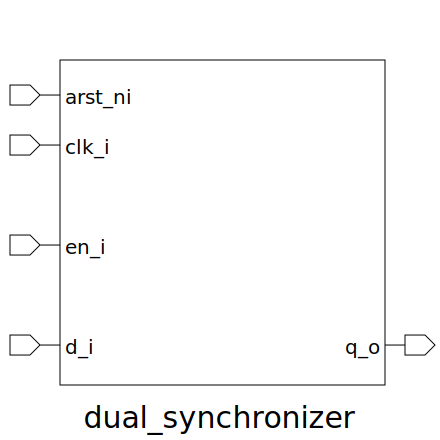

# dual_synchronizer (module)

### Author : Foez Ahmed (foez.official@gmail.com)

## TOP IO

## Description

## Parameters
|Name|Type|Dimension|Default Value|Description|
|-|-|-|-|-|
|FIRST_FF_EDGE_POSEDGED|bit||0||
|LAST_FF_EDGE_POSEDGED|bit||0||

## Ports
|Name|Direction|Type|Dimension|Description|
|-|-|-|-|-|
|arst_ni|input|logic|||
|clk_i|input|logic|||
|en_i|input|logic|||
|d_i|input|logic|||
|q_o|output|logic|||
