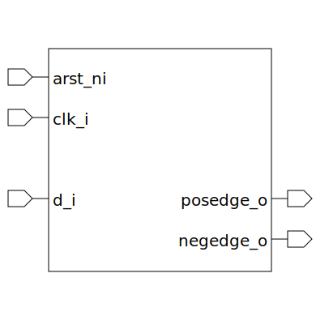

# edge_detector (module)

### Author : Foez Ahmed (foez.official@gmail.com)

## TOP IO

## Description

The `edge_detector` module is a configurable edge detector that can detect positive and/or negative
edges.

The edge detector operates based on the `POSEDGE`, `NEGEDGE`, and `ASYNC` parameters. If `POSEDGE`
is set, the detector will output a signal when a positive edge is detected. If `NEGEDGE` is set, the
detector will output a signal when a negative edge is detected. The `ASYNC` parameter determines
whether to use a dual synchronizer or a single synchronizer for the edge detection process.

The edge detector uses a dual synchronizer when `ASYNC` is set, and a single synchronizer otherwise.
The synchronizer takes the data input and outputs an intermediate signal, which is then used to
detect the edges. The final signal after the edge detection process is stored in a flip-flop.

## Parameters
|Name|Type|Dimension|Default Value|Description|
|-|-|-|-|-|
|POSEDGE|bit||1|A bit that determines whether to detect positive edges|
|NEGEDGE|bit||1|A bit that determines whether to detect negative edges|
|ASYNC|bit||0|A bit that determines whether to use asynchronous mode|

## Ports
|Name|Direction|Type|Dimension|Description|
|-|-|-|-|-|
|arst_ni|input|logic||asynchronous active low reset signal|
|clk_i|input|logic||global clock signal|
|d_i|input|logic||data input signal|
|posedge_o|output|logic||positive edge detected signal|
|negedge_o|output|logic||negative edge detected signal|
