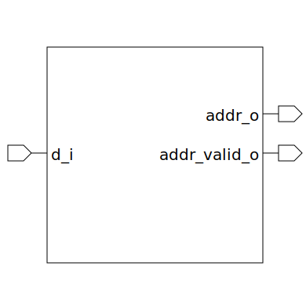

# encoder (module)

### Author : Foez Ahmed (foez.official@gmail.com)

## TOP IO

## Description

The `encoder` module is a priority encoder with a configurable number of output wires.

The encoder operates based on the `d_i` and `addr_or_red` signals. It uses a for loop to generate
the `addr_or_red` array, which is used to calculate the address output. The address output is the
bitwise OR of the `addr_or_red` array. The address valid output is the bitwise OR of the wire input.

The encoder uses assignments to calculate the `addr_or_red` array, the address output, and the
address valid output. The `addr_or_red` array is calculated in a for loop, where each element is the
bitwise OR of a subset of the wire input. The address output is the bitwise OR of the `addr_or_red`
array. The address valid output is the bitwise OR of the wire input.

## Parameters
|Name|Type|Dimension|Default Value|Description|
|-|-|-|-|-|
|NUM_WIRE|int||16|number of output wires|

## Ports
|Name|Direction|Type|Dimension|Description|
|-|-|-|-|-|
|d_i|input|logic [NUM_WIRE-1:0]|| wire input|
|addr_o|output|logic [$clog2(NUM_WIRE)-1:0]|| address output|
|addr_valid_o|output|logic|| address valid output. It indicates whether the address output is valid|
