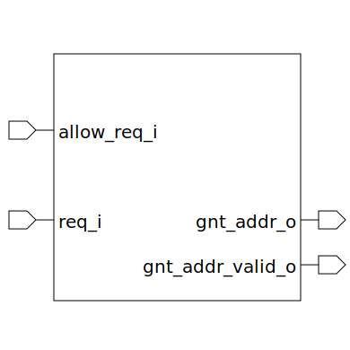

# fixed_priority_arbiter (module)

### Author : Foez Ahmed (foez.official@gmail.com)

## TOP IO

## Description

The `fixed_priority_arbiter` module is a priority arbiter with a fixed priority scheme.

The arbiter operates based on the `allow_req_i` and The priority encoder's address valid signal
signals. When requests are allowed and the address is valid, the arbiter grants the request with
the highest priority.

The arbiter uses a priority encoder to determine which request to grant. The priority encoder has
a fixed priority scheme, with the request at index 0 having the highest priority. The priority
encoder takes the request signals as input and outputs the grant address and a valid signal.

## Parameters
|Name|Type|Dimension|Default Value|Description|
|-|-|-|-|-|
|NUM_REQ|int||4|number of requests that the arbiter can handle|

## Ports
|Name|Direction|Type|Dimension|Description|
|-|-|-|-|-|
|allow_req_i|input|logic|| signal that allows requests to be made|
|req_i|input|logic [NUM_REQ-1:0]|| signal that allows requests to be made|
|gnt_addr_o|output|logic [$clog2(NUM_REQ)-1:0]|| grant address|
|gnt_addr_valid_o|output|logic|| grant valid signal. It indicates whether the grant address is valid|
