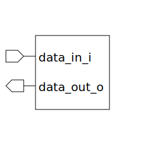

# gray_to_bin (module)

### Author : Foez Ahmed (foez.official@gmail.com)

## TOP IO

## Description

The `gray_to_bin` module is a parameterized SystemVerilog module that converts a Gray code input to
a binary code output. The module uses a loop and an XOR operation to perform the conversion.

## Parameters
|Name|Type|Dimension|Default Value|Description|
|-|-|-|-|-|
|DATA_WIDTH|int||4|width of the data|

## Ports
|Name|Direction|Type|Dimension|Description|
|-|-|-|-|-|
|data_in_i|input|logic [DATA_WIDTH-1:0]|| Gray code input|
|data_out_o|output|logic [DATA_WIDTH-1:0]|| binary code output|
