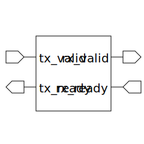

# handshake_combiner (module)

### Author : Foez Ahmed (foez.official@gmail.com)

## TOP IO

## Description

The `handshake_combiner` module is a parameterized SystemVerilog module that combines handshake
signals from multiple source(s) & destination(s). The module uses two `always_comb` blocks to
generate the `tx_ready` and `rx_valid` signals based on the `tx_valid` and `rx_ready` inputs.

## Parameters
|Name|Type|Dimension|Default Value|Description|
|-|-|-|-|-|
|NUM_TX|int||2|number of transmitter handshakes|
|NUM_RX|int||2|number of receiver handshakes|

## Ports
|Name|Direction|Type|Dimension|Description|
|-|-|-|-|-|
|tx_valid|input|logic [NUM_TX-1:0]|| transmitter valid signals|
|tx_ready|output|logic [NUM_TX-1:0]|| transmitter ready signals|
|rx_valid|output|logic [NUM_RX-1:0]|| receiver valid signals|
|rx_ready|input|logic [NUM_RX-1:0]|| receiver ready signals|
