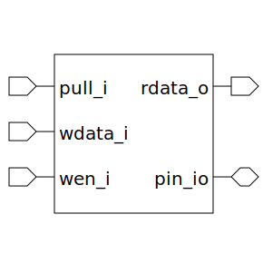

# io_pad (module)

### Author : Foez Ahmed (foez.official@gmail.com)

## TOP IO

## Description

The `io_pad` module is a SystemVerilog module that implements an I/O pad. The module uses a
pull-down buffer, a data drive buffer, and a read data buffer to control the I/O pad.

## Parameters
|Name|Type|Dimension|Default Value|Description|
|-|-|-|-|-|

## Ports
|Name|Direction|Type|Dimension|Description|
|-|-|-|-|-|
|pull_i|input|wire||The pull-down control signal|
|wdata_i|input|wire||The write data signal|
|wen_i|input|wire||The write enable signal|
|rdata_o|output|wire||The read data signal|
|pin_io|inout|wire||The I/O pad pin|
