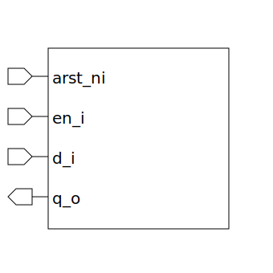

# latch (module)

### Author : Foez Ahmed (foez.official@gmail.com)

## TOP IO

## Description

The `latch` module is a parameterized SystemVerilog module that implements a latch. The module uses
a sequential block to control the state of the latch.

## Parameters
|Name|Type|Dimension|Default Value|Description|
|-|-|-|-|-|
|DATA_WIDTH|int||8|width of the data|

## Ports
|Name|Direction|Type|Dimension|Description|
|-|-|-|-|-|
|arst_ni|input|logic||asynchronous active low reset signal|
|en_i|input|logic||latch enable signal|
|d_i|input|logic [DATA_WIDTH-1:0]||latch data input|
|q_o|output|logic [DATA_WIDTH-1:0]||latch data output|
