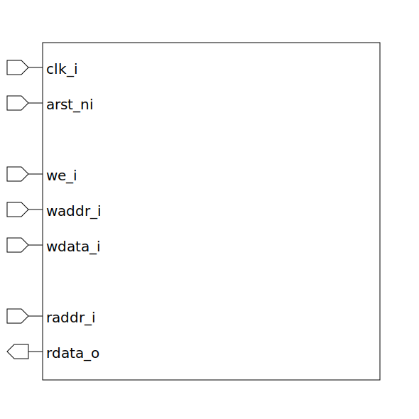

# mem (module)

### Author : Foez Ahmed (foez.official@gmail.com)

## TOP IO

## Description

The `mem` module is a parameterized SystemVerilog module that implements a memory. The module uses a
demultiplexer (`demux`), a register array (`register_dut`), and a multiplexer (`mux`) to control the
memory.

## Parameters
|Name|Type|Dimension|Default Value|Description|
|-|-|-|-|-|
|ELEM_WIDTH|int||8|Memory element width|
|DEPTH|int||7|Memory depth|

## Ports
|Name|Direction|Type|Dimension|Description|
|-|-|-|-|-|
|clk_i|input|logic||Global clock|
|arst_ni|input|logic||asynchronous active low reset|
|we_i|input|logic||Write enable|
|waddr_i|input|logic [$clog2(DEPTH)-1:0]||Write address|
|wdata_i|input|logic [ ELEM_WIDTH-1:0]||write data|
|raddr_i|input|logic [$clog2(DEPTH)-1:0]||Read address|
|rdata_o|output|logic [ ELEM_WIDTH-1:0]||Read data|
