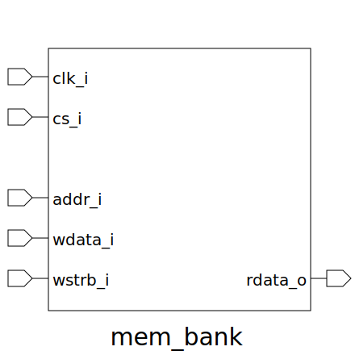

# mem_bank (module)

### Author : Foez Ahmed (foez.official@gmail.com)

## TOP IO

## Description

The `mem_bank` module is a parameterized SystemVerilog module that implements a memory bank. The
module uses a loop to generate multiple instances of the `mem_core` module, each with its own write
enable signal.

## Parameters
|Name|Type|Dimension|Default Value|Description|
|-|-|-|-|-|
|ADDR_WIDTH|int||8| width of the memory bank address|
|DATA_SIZE|int||2| base-2 logarithm of the number of bytes in the data bus|

## Ports
|Name|Direction|Type|Dimension|Description|
|-|-|-|-|-|
|clk_i|input|logic||The global clock signal|
|cs_i|input|logic||The asynchronous active low reset signal|
|addr_i|input|logic [ ADDR_WIDTH-1:0]||The aligned byte address|
|wdata_i|input|logic [(8*(2**DATA_SIZE))-1:0]||The aligned write data|
|wstrb_i|input|logic [ (2**DATA_SIZE)-1:0]||The aligned write strobe|
|rdata_o|output|logic [(8*(2**DATA_SIZE))-1:0]||The aligned read data|
