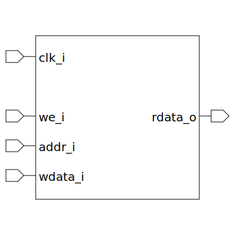

# mem_core (module)

### Author : Foez Ahmed (foez.official@gmail.com)

## TOP IO

## Description

Write a markdown documentation for this systemverilog module:

## Parameters
|Name|Type|Dimension|Default Value|Description|
|-|-|-|-|-|
|ELEM_WIDTH|int||8|Width of each memory data element|
|ADDR_WIDTH|int||8|Width of the address bus|

## Ports
|Name|Direction|Type|Dimension|Description|
|-|-|-|-|-|
|clk_i|input|logic||Global clock|
|we_i|input|logic||Write enable|
|addr_i|input|logic [ADDR_WIDTH-1:0]||Address bus input|
|wdata_i|input|logic [ELEM_WIDTH-1:0]||Write data|
|rdata_o|output|logic [ELEM_WIDTH-1:0]||Read data|
