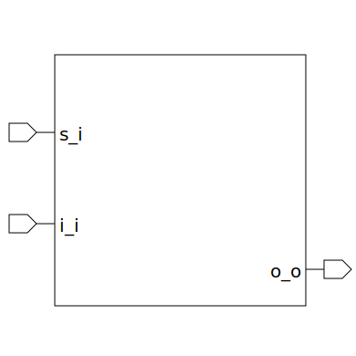

# mux (module)

### Author : Foez Ahmed (foez.official@gmail.com)

## TOP IO

## Description
 General purpose MUX

## Parameters
|Name|Type|Dimension|Default Value|Description|
|-|-|-|-|-|
|ELEM_WIDTH|int||8|Width of each mux input element|
|NUM_ELEM|int||6|Number of elements in the mux|

## Ports
|Name|Direction|Type|Dimension|Description|
|-|-|-|-|-|
|s_i|input|logic [$clog2(NUM_ELEM)-1:0]||select|
|i_i|input|logic [NUM_ELEM-1:0][ELEM_WIDTH-1:0]||Array of input bus|
|o_o|output|logic [ELEM_WIDTH-1:0]||Output bus|
