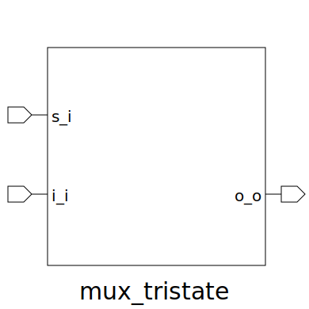

# mux_tristate (module)

### Author : Foez Ahmed (foez.official@gmail.com)

## TOP IO

## Description

The `mux_tristate` module is a parameterized SystemVerilog module that implements a multiplexer.
The module uses a loop to generate multiple assignments and buffers to control the output of the
multiplexer.

## Parameters
|Name|Type|Dimension|Default Value|Description|
|-|-|-|-|-|
|ELEM_WIDTH|int||8|width of each multiplexer input element|
|NUM_ELEM|int||6|number of elements in the multiplexer|

## Ports
|Name|Direction|Type|Dimension|Description|
|-|-|-|-|-|
|s_i|input|logic [NUM_ELEM-1:0]||select|
|i_i|input|logic [NUM_ELEM-1:0][ELEM_WIDTH-1:0]||Array of input bus|
|o_o|output|logic [ELEM_WIDTH-1:0]||Output bus|
