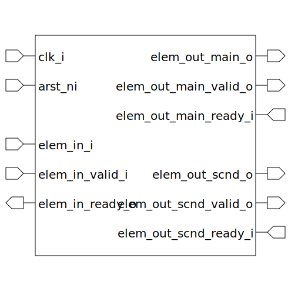

# pipeline_branch (module)

### Author : Foez Ahmed (foez.official@gmail.com)

## TOP IO

## Description

The `pipeline_branch` module is a parameterized SystemVerilog module that implements a pipeline
branch. The module uses a `pipeline_core` instance to process the input data and then branches the
output to two different paths.

## Parameters
|Name|Type|Dimension|Default Value|Description|
|-|-|-|-|-|
|ELEM_WIDTH|int||8|width of each pipeline element|

## Ports
|Name|Direction|Type|Dimension|Description|
|-|-|-|-|-|
|clk_i|input|logic|| global clock signal|
|arst_ni|input|logic|| asynchronous active low reset signal|
|elem_in_i|input|logic [ELEM_WIDTH-1:0]|| input element|
|elem_in_valid_i|input|logic|| input element valid signal|
|elem_in_ready_o|output|logic|| input element ready signal|
|elem_out_main_o|output|logic [ELEM_WIDTH-1:0]|| main output element|
|elem_out_main_valid_o|output|logic|| main output element valid signal|
|elem_out_main_ready_i|input|logic|| main output element ready signal|
|elem_out_scnd_o|output|logic [ELEM_WIDTH-1:0]|| secondary output element|
|elem_out_scnd_valid_o|output|logic|| secondary output element valid signal|
|elem_out_scnd_ready_i|input|logic|| secondary output element ready signal|
