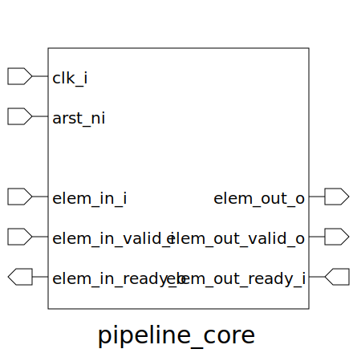

# pipeline_core (module)

### Author : Foez Ahmed (foez.official@gmail.com)

## TOP IO

## Description

The `pipeline_core` module is a parameterized SystemVerilog module that implements a pipeline core.
The module uses a flip-flop to control the state of the pipeline based on the input and output
handshakes.

## Parameters
|Name|Type|Dimension|Default Value|Description|
|-|-|-|-|-|
|ELEM_WIDTH|int||8|width of each pipeline element|

## Ports
|Name|Direction|Type|Dimension|Description|
|-|-|-|-|-|
|clk_i|input|logic||global clock signal|
|arst_ni|input|logic||asynchronous active low reset signal|
|elem_in_i|input|logic [ELEM_WIDTH-1:0]||input element|
|elem_in_valid_i|input|logic||input element valid signal|
|elem_in_ready_o|output|logic||input element ready signal|
|elem_out_o|output|logic [ELEM_WIDTH-1:0]||output element|
|elem_out_valid_o|output|logic||output element valid signal|
|elem_out_ready_i|input|logic||output element ready signal|
