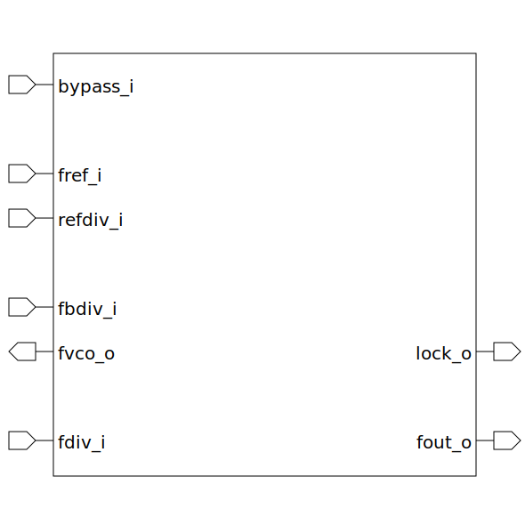

# pll_model (module)

### Author : Foez Ahmed (foez.official@gmail.com)

## TOP IO

## Description
 This is a non-synthesizable model of the PLL circuit, designed for verification purpose only.

## Parameters
|Name|Type|Dimension|Default Value|Description|
|-|-|-|-|-|

## Ports
|Name|Direction|Type|Dimension|Description|
|-|-|-|-|-|
|bypass_i|input|logic||bypass the reference frequency to fout_o|
|fref_i|input|logic||reference frequency|
|refdiv_i|input|logic [7:0]||reference frequency divider|
|lock_o|output|logic||PLL lock|
|fbdiv_i|input|logic [15:0]||VCO feedback voltage divider|
|fvco_o|output|logic||VCO frequency|
|fdiv_i|input|logic [7:0]||reference frequency divider|
|fout_o|output|logic||output frequency|
