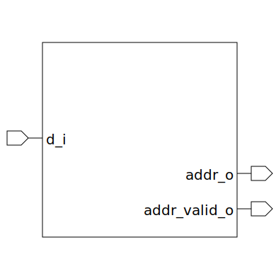

# priority_encoder (module)

### Author : Foez Ahmed (foez.official@gmail.com)

## TOP IO

## Description

The `priority_encoder` module is a simple priority encoder with a configurable number of output
wires and priority direction.

## Parameters
|Name|Type|Dimension|Default Value|Description|
|-|-|-|-|-|
|NUM_WIRE|int||4|Number of output wires|
|HIGH_INDEX_PRIORITY|bit||0|Prioritize Higher index|

## Ports
|Name|Direction|Type|Dimension|Description|
|-|-|-|-|-|
|d_i|input|logic [NUM_WIRE-1:0]||Wire input|
|addr_o|output|logic [$clog2(NUM_WIRE)-1:0]||Address output|
|addr_valid_o|output|logic||Address Valid output|
