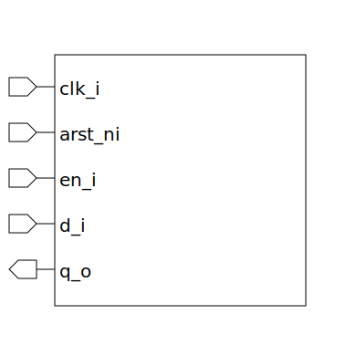

# register (module)

### Author : Foez Ahmed (foez.official@gmail.com)

## TOP IO

## Description

The `register` module is a simple register with configurable element width and reset value.

## Parameters
|Name|Type|Dimension|Default Value|Description|
|-|-|-|-|-|
|ELEM_WIDTH|int||32|width of each element|
|RESET_VALUE|bit [ELEM_WIDTH-1:0]||'0|reset value for each element|

## Ports
|Name|Direction|Type|Dimension|Description|
|-|-|-|-|-|
|clk_i|input|logic||clock input|
|arst_ni|input|logic||asynchronous active low reset input|
|en_i|input|logic||enable input|
|d_i|input|logic [ELEM_WIDTH-1:0]||data input|
|q_o|output|logic [ELEM_WIDTH-1:0]||output|
