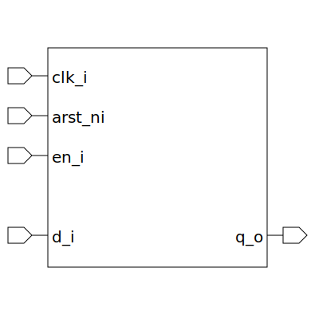

# register_dual_flop (module)

### Author : Foez Ahmed (foez.official@gmail.com)

## TOP IO

## Description

The `register_dual_flop` module is a dual flip-flop register with configurable element width, reset
value, and clock edge polarity for both flip-flops.

## Parameters
|Name|Type|Dimension|Default Value|Description|
|-|-|-|-|-|
|ELEM_WIDTH|int||32| width of each element|
|RESET_VALUE|bit [ELEM_WIDTH-1:0]||'0| reset value for each element|
|FIRST_FF_EDGE_POSEDGED|bit||1| A bit to set the clock edge polarity of the first flip-flop|
|LAST_FF_EDGE_POSEDGED|bit||0| A bit to set the clock edge polarity of the last flip-flop|

## Ports
|Name|Direction|Type|Dimension|Description|
|-|-|-|-|-|
|clk_i|input|logic||clock input|
|arst_ni|input|logic||asynchronous active low reset input|
|en_i|input|logic||enable input|
|d_i|input|logic [ELEM_WIDTH-1:0]||data input|
|q_o|output|logic [ELEM_WIDTH-1:0]||data output|
