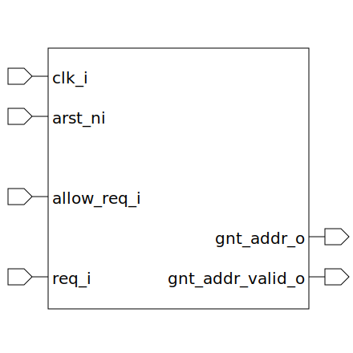

# round_robin_arbiter (module)

### Author : Foez Ahmed (foez.official@gmail.com)

## TOP IO

## Description

The `round_robin_arbiter` module is a round-robin arbiter with a configurable number of requests.

## Parameters
|Name|Type|Dimension|Default Value|Description|
|-|-|-|-|-|
|NUM_REQ|int||4|number of requests|

## Ports
|Name|Direction|Type|Dimension|Description|
|-|-|-|-|-|
|clk_i|input|logic||Global clock|
|arst_ni|input|logic||Asynchronous reset|
|allow_req_i|input|logic||Allow requests|
|req_i|input|logic [NUM_REQ-1:0]||Allow requests|
|gnt_addr_o|output|logic [$clog2(NUM_REQ)-1:0]||Grant Address|
|gnt_addr_valid_o|output|logic||Grant Valid|
