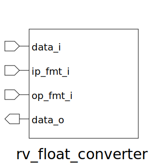

# rv_float_converter (module)

### Author : Foez Ahmed (foez.official@gmail.com)

## TOP IO

## Description

Write a markdown documentation for this systemverilog module:

| Precision              | Sign Bit | Exponent Bits | mantissa Bits | Bias  | Format |
|------------------------|----------|---------------|---------------|-------|--------|
| 16b (Half Precision)   | 1 (15)   | 5 [14:10]     | 10 [9:0]      | 15    | 10     |
| 32b (Single Precision) | 1 (31)   | 8 [30:23]     | 23 [22:0]     | 127   | 00     |
| 64b (Double Precision) | 1 (63)   | 11 [62:52]    | 52 [51:0]     | 1023  | 01     |
| 128b (Quad Precision)  | 1 (127)  | 15 [126:112]  | 112 [111:0]   | 16383 | 11     |

0100000

## Parameters
|Name|Type|Dimension|Default Value|Description|
|-|-|-|-|-|
|UP_CONV|bit||1||
|DOWN_CONV|bit||0||
|DOUBLE|bit||1||
|QUAD|bit||1||

## Ports
|Name|Direction|Type|Dimension|Description|
|-|-|-|-|-|
|data_i|input|logic [MaxRegWidth-1:0]|||
|ip_fmt_i|input|logic [ 1:0]|||
|op_fmt_i|input|logic [ 1:0]|||
|data_o|output|logic [MaxRegWidth-1:0]|||
