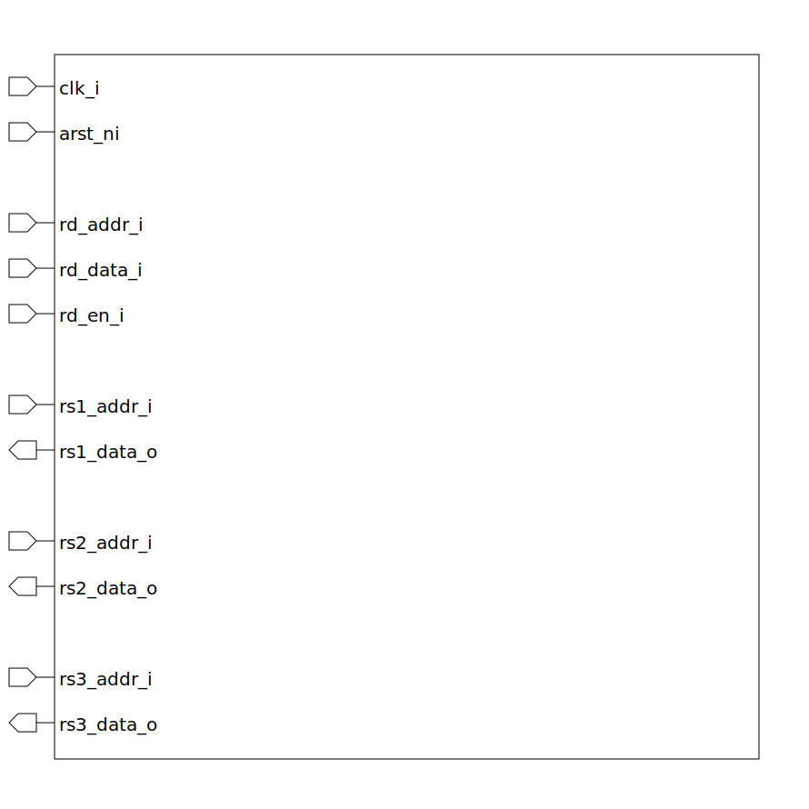

# rv_vec_reg_file (module)

### Author : Md. Mohiuddin Reyad (mreyad30207@gmail.com)

## TOP IO

## Description
 Register file for vector

## Parameters
|Name|Type|Dimension|Default Value|Description|
|-|-|-|-|-|
|VLEN|int||128||

## Ports
|Name|Direction|Type|Dimension|Description|
|-|-|-|-|-|
|clk_i|input|logic||Global clock|
|arst_ni|input|logic||Asynchronous reset|
|rd_addr_i|input|logic [ 4:0]||destination register address|
|rd_data_i|input|logic [VLEN-1:0]||read data|
|rd_en_i|input|logic||read enable|
|rs1_addr_i|input|logic [ 4:0]||source register 1 address|
|rs1_data_o|output|logic [VLEN-1:0]||source register 1 data|
|rs2_addr_i|input|logic [ 4:0]||source register 2 address|
|rs2_data_o|output|logic [VLEN-1:0]||source register 2 data|
|rs3_addr_i|input|logic [ 4:0]||source register 3 address|
|rs3_data_o|output|logic [VLEN-1:0]||source register 3 data|
