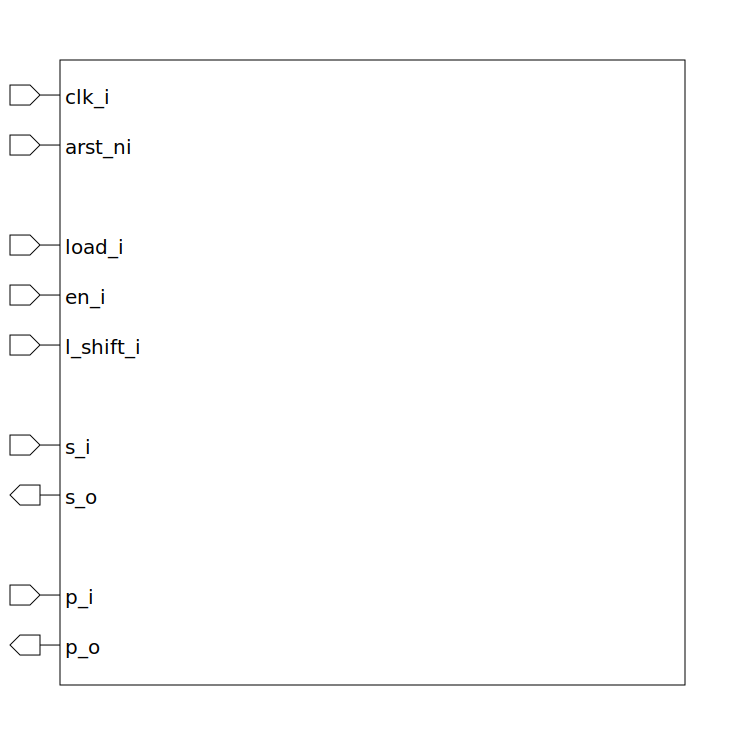

# shift_register (module)

### Author : Foez Ahmed (foez.official@gmail.com)

## TOP IO

## Description

The `shift_register` module is a shift register with configurable element width and depth. It can
load data, enable shifting, and shift left.

## Parameters
|Name|Type|Dimension|Default Value|Description|
|-|-|-|-|-|
|ELEM_WIDTH|int||4|width of each element|
|DEPTH|int||8|depth of the shift register|

## Ports
|Name|Direction|Type|Dimension|Description|
|-|-|-|-|-|
|clk_i|input|logic|| clock input|
|arst_ni|input|logic|| asynchronous active low reset input|
|load_i|input|logic|| load input|
|en_i|input|logic|| enable input|
|l_shift_i|input|logic|| left shift input|
|s_i|input|logic [ELEM_WIDTH-1:0]|| data input|
|s_o|output|logic [ELEM_WIDTH-1:0]|| data output|
|p_i|input|logic [DEPTH-1:0][ELEM_WIDTH-1:0]|| An array of data inputs|
|p_o|output|logic [DEPTH-1:0][ELEM_WIDTH-1:0]|| An array of data outputs|
