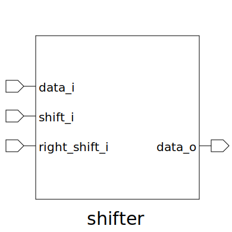

# shifter (module)

### Author : Foez Ahmed (foez.official@gmail.com)

## TOP IO

## Description

The shifter module performs data shifting operations. It takes input data, shift control signals,
and produces the shifted output data.

## Parameters
|Name|Type|Dimension|Default Value|Description|
|-|-|-|-|-|
|DATA_WIDTH|int||4|Specifies the width of the input and output data|
|SHIFT_WIDTH|int||3|Determines the number of shift stages|

## Ports
|Name|Direction|Type|Dimension|Description|
|-|-|-|-|-|
|shift_i|input|logic [SHIFT_WIDTH-1:0]||Defines the amount of shift|
|right_shift_i|input|logic||Defines whether to right shift|
|data_i|input|logic [ DATA_WIDTH-1:0]||Input data to be shifted|
|data_o|output|logic [DATA_WIDTH-1:0]||Output data after shifting|
