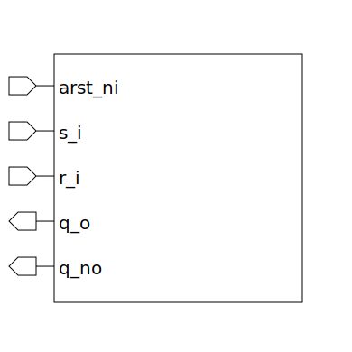

# sr_latch_arstn (module)

### Author : Foez Ahmed (foez.official@gmail.com)

## TOP IO

## Description

The `sr_latch_arstn` module is an SR latch with asynchronous active low reset.

## Parameters
|Name|Type|Dimension|Default Value|Description|
|-|-|-|-|-|

## Ports
|Name|Direction|Type|Dimension|Description|
|-|-|-|-|-|
|arst_ni|input|logic||asynchronous active low reset input|
|s_i|input|logic||set input|
|r_i|input|logic||reset input|
|q_o|output|logic||Q output|
|q_no|output|logic||inverted Q output|
