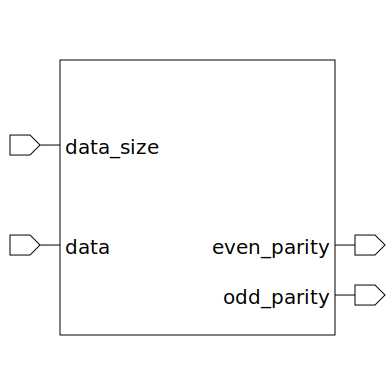

# uart_parity_checker (module)

### Author : Foez Ahmed (foez.official@gmail.com)

## TOP IO

## Description

The `uart_parity_checker` module is a parity checker for UART (Universal Asynchronous Receiver/Transmitter) data.

## Parameters
|Name|Type|Dimension|Default Value|Description|
|-|-|-|-|-|

## Ports
|Name|Direction|Type|Dimension|Description|
|-|-|-|-|-|
|data_size|input|logic [1:0]|| A 2-bit logic input representing the size of the data|
|data|input|logic [7:0]|| A 2-bit logic input representing the size of the data|
|even_parity|output|logic|| A logic output representing the even parity of the data|
|odd_parity|output|logic|| A logic output representing the odd parity of the data|
