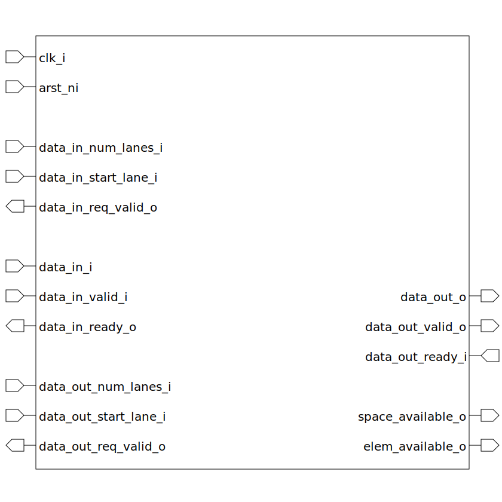

# var_fifo (module)

### Author : Foez Ahmed (foez.official@gmail.com)

## TOP IO

## Description

The `var_fifo` module is a variable-width FIFO with configurable element width, number of elements,
and FIFO depth.

## Parameters
|Name|Type|Dimension|Default Value|Description|
|-|-|-|-|-|
|ELEM_WIDTH|int||8|width of each element|
|NUM_ELEM|int||128|number of elements|
|FIFO_DEPTH|int||2 * NUM_ELEM|depth of the FIFO|

## Ports
|Name|Direction|Type|Dimension|Description|
|-|-|-|-|-|
|clk_i|input|logic|| clock input|
|arst_ni|input|logic|| asynchronous active low reset input|
|data_in_num_lanes_i|input|logic [$clog2(NUM_ELEM+1)-1:0]|| number of input data lanes|
|data_in_start_lane_i|input|logic [ $clog2(NUM_ELEM)-1:0]|| start lane of the input data|
|data_in_req_valid_o|output|logic|| input data request valid signal|
|data_in_i|input|logic [NUM_ELEM-1:0][ELEM_WIDTH-1:0]|| An array of input data|
|data_in_valid_i|input|logic|| input data valid signal|
|data_in_ready_o|output|logic|| input data ready signal|
|data_out_num_lanes_i|input|logic [$clog2(NUM_ELEM+1)-1:0]|| number of output data lanes|
|data_out_start_lane_i|input|logic [ $clog2(NUM_ELEM)-1:0]|| start lane of the output data|
|data_out_req_valid_o|output|logic|| output data request valid signal|
|data_out_o|output|logic [NUM_ELEM-1:0][ELEM_WIDTH-1:0]|| An array of output data|
|data_out_valid_o|output|logic|| output data valid signal|
|data_out_ready_i|input|logic|| output data ready signal|
|space_available_o|output|logic [$clog2(FIFO_DEPTH+1)-1:0]|| available space in the FIFO|
|elem_available_o|output|logic [$clog2(FIFO_DEPTH+1)-1:0]|| available elements in the FIFO|
