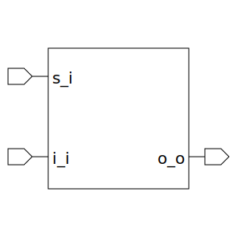

# xbar (module)

### Author : Foez Ahmed (foez.official@gmail.com)

## TOP IO

## Description

The `xbar` module is a configurable crossbar switch implemented in SystemVerilog. A crossbar switch
is a device that connects multiple inputs to multiple outputs in a matrix manner. It's a crucial
component in many digital systems, including multiprocessor interconnection networks and telephone
exchanges.

This module is highly configurable with two parameters: `ELEM_WIDTH` and `NUM_ELEM`. `ELEM_WIDTH`
specifies the width of each crossbar element, and `NUM_ELEM` determines the number of elements in
the crossbar.

The module has three main parts: input bus select (`s_i`), array of input bus (`i_i`), and array of
output bus (`o_o`). The `s_i` is a logic input that selects which input bus to connect to the output
bus. The `i_i` is an array of logic inputs that represent the different input buses. The `o_o` is an
array of logic outputs that represent the different output buses.

Internally, the module uses a logic array `selects` for handling offset in the input bus select. The
module also contains a conditional assignment block that assigns the select lines based on the
overflow condition.

Finally, the module uses a `mux` (multiplexer) module to connect the selected input bus to the
output bus. The `mux` module is instantiated in a generate loop, creating a separate multiplexer for
each output bus.

## Parameters
|Name|Type|Dimension|Default Value|Description|
|-|-|-|-|-|
|ELEM_WIDTH|int||8|Width of each crossbar element|
|NUM_ELEM|int||6|Number of elements in the crossbar|

## Ports
|Name|Direction|Type|Dimension|Description|
|-|-|-|-|-|
|s_i|input|logic [NUM_ELEM-1:0][$clog2(NUM_ELEM)-1:0]||Input bus select|
|i_i|input|logic [NUM_ELEM-1:0][ELEM_WIDTH-1:0]||Array of input bus|
|o_o|output|logic [NUM_ELEM-1:0][ELEM_WIDTH-1:0]||Array of output bus|
